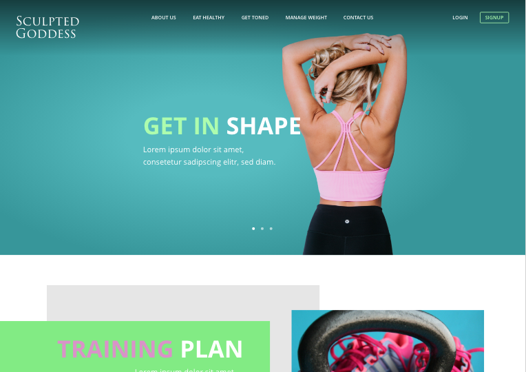

# Sculpted Goddess

A fitness and nutrition app with accounts, a macronutrient calculator, and a saved-recipe library.

**Live:** https://sculpted-goddess.vercel.app

<!-- TODO: replace with a current screenshot -->



Signed-in users enter their body metrics once and get a daily calorie and
macronutrient target from the Mifflin-St Jeor equation, then search TheMealDB
and save the recipes that fit. Built for women who want a concrete number to
plan meals against rather than another tracker.

## Stack

- Next.js 14.2 App Router, React 18, TypeScript `strict`
- Turso / libSQL, parameterised SQL, no ORM
- Lucia v3 sessions, scrypt hashing, Zod validation
- Sass modules and CSS custom properties
- TheMealDB, Nodemailer over Zoho SMTP
- Vercel

## Engineering notes

**Hand-written Lucia adapter** (`lib/luciaAdapter.ts`). Lucia v3 shipped no
libSQL adapter, so all thirteen methods are implemented against the interface
directly, including a joined `getSessionAndUser` and Unix-second/`Date`
conversion at the boundary — cheaper than switching databases for a supported
one.

**One source of truth for design tokens.** The type scale is declared once in
Sass and re-emitted as CSS custom properties per breakpoint
(`app/globals.scss`), so components size text with `var(--font-h1-size)` and
hold no media queries. An ICSS `:export` block
(`public/styles/constants.module.scss`) hands the same tokens to TypeScript,
defining colours and sizes once.

**Output constraints, not just input validation.** A calculator returning a
number people act on has to refuse to return a dangerous one. Calories are
floored at 1200 for women and 1500 for men, target weight cannot fall below BMI
18.5 for the entered height, and age is bounded 18–100. Enforced in a Zod schema
on the server (`lib/dietaryProfileSchema.ts`): server actions are directly
invocable, so client-side bounds are advisory.

**Derived state centralised in context.** `WeightContext.tsx` computes BMI, BMR,
TDEE, target calories, macro grams and chart percentages in one place; consumers
receive finished values and stay presentational, keeping the domain formulas in
one readable block.

**Race-condition defence.** `EatHealthyClient.tsx` shows either search results or
saved recipes. A search resolving after the user switches views would overwrite
the saved list, so late results are discarded and the search input is unmounted
in saved mode.

**TODO — RGPD consent.** The app stores body metrics, which is health data under
Article 9. The consent flow, privacy policy and deletion path are not built yet.

## Setup

Requires Node 22.15+ (`.nvmrc`), a Turso database, and SMTP credentials.

```bash
nvm use
npm install
npm run dev     # http://localhost:3000
```

```bash
npm run build && npm start
npm run lint
```

Copy `.env.example` to `.env.local` and fill in:

- `TURSO_DATABASE_URL`, `TURSO_AUTH_TOKEN` — libSQL connection
- `THEMEALDB_BASE_URL`, `THEMEALDB_API_KEY` — recipe API
- `ZOHO_SMTP_HOST`, `PORT`, `USER`, `PASS` — contact form delivery

There is no test suite yet.

## Known limitations

- Next 14 and React 18. `useFormState` predates React 19's `useActionState`.
- Route segments are `snake_case` except `/design-system`; should be unified on
  kebab-case.
- No `error.tsx` or `loading.tsx`: uncaught server errors fall through to the
  default Next page, and there are no streaming boundaries.
- No migration system. Tables are created with `CREATE TABLE IF NOT EXISTS` as a
  cold-start side effect (`lib/db.ts`).
- Every route renders dynamically because the root layout reads the session
  cookie for navbar state; the marketing pages should be static.
- Accessibility is partial. The recipe cards, modal and mobile menu handle
  keyboard and ARIA; form inputs still rely on placeholders rather than labels.
- Colour contrast across the pink and aqua palette is unmeasured against WCAG AA.
